#  
**ACYE1_202110509**

## 
**PRACTICA 4**

## 📌 **Manual de Usuario**

- **Menú**

    Al iniciar el ejecutable el usuario podrá visualizar el menú principal de la aplicación así como información
    del desarrollador de la misma. 

    Dentro del menú se pueden acceder a distintas opciones, ingresando el número de la opción correspondiente.

    

        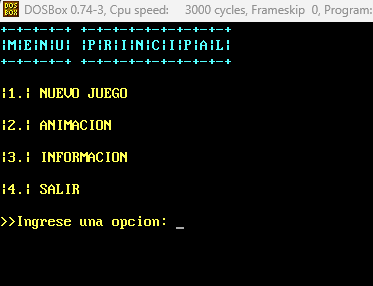
    

- **Nuevo Juego**

    Al iniciar un nuevo juego, encontraremos un submenú, en donde podremos seleccionar un modo de juego, así mismo regresar al menú principal o visualizar los reportes generados.

    

        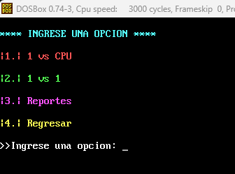
    

    **1 vs CPU**

    En esta opción podremos competir contra la IA del sistema, en donde será una partida rápida y divertida, debemos ingresar nuestro nickname y posteriormente las posiciones de juego. Podemos finalizar la partida presionado la tecla de escape ("ESC").

    

        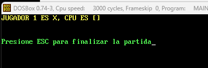
    

    **1 vs 1**

    En esta opción podremos competir contra otro jugador, en donde será una partida rápida y divertida, debemos ingresar nuestros nicknames y posteriormente las posiciones de juego. Podemos finalizar la partida presionado la tecla de escape ("ESC").

    

        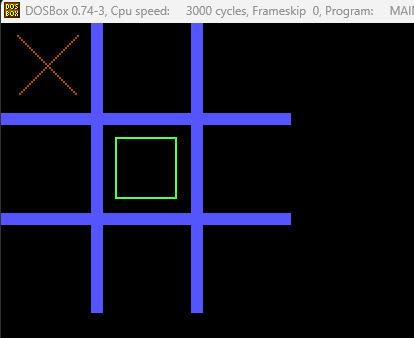
    

    **POSIBLES ERRORES**

    *Fila/Columna inválidos:*

    Se consideran algunos errores dentro de la aplicación, por ejemplo número de columna/fila inválida, esto se debe a que el usuario intenta ingresar un número fuera del rango permitido, ya que es un tablero de 3x3, pasarse de 3 filas o de 3 columnas, es salirse del rango, por lo tanto la aplicación advierte al usuario que dichos movimientos no son válidos.

    

        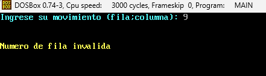
    

    

        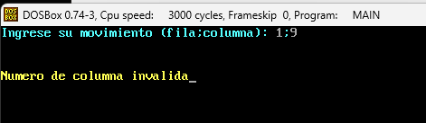
    

    *Casilla Llena:*

    Este error indica que el usuario intenta colocar en un casilla ya sea una "X" o un "O" en una casilla previamente ocupada, por lo que se le notificará que debe ingresar otra posición, ya que esa no se encuentra disponible.

    

        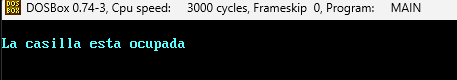
    

    **Reportes**

    Dentro de esta sección podemos ver los reportes generados en cada partida.

    **Regresar**
    
    Elegir esta opcion nos devolverá al menú principal de la aplicación.

- **Animación**

    Al seleccionar esta opción del menú, se podrá cargar un archivo de entrada y se hará una animación de un ascii art de manera gradual. Se podrán visualizar ocho animaciones, aclarando también que solo se pueden cargar entre 1 y 8 imágenes en el archivo de entrada. Para detener las animaciones y volver al menú, es suficiente con presionar la barra espaciadora.

- **Informacion**

    Esta opción mostrará en pantalla un encabezado con la información del desarrollador.

    

        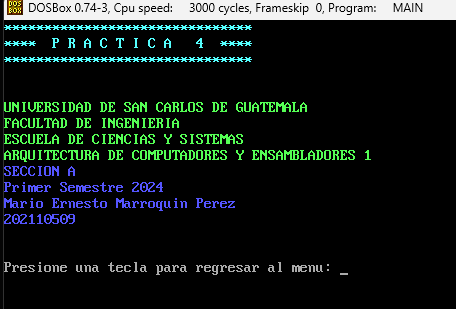
    

- **Salir**

    Se detiene el flujo de la aplicación y finaliza.

## 📌 **Manual Técnico**

- **Herramientas y Entorno de Desarrollo**

    La práctica fue realizada en Windows 11, utilizando software libre como el editor de código Visual Studio Code, DOSbox 0.74-3 y emu8086.

    Trabajando con MASM y distintas extensiones para VSCode.

    Las extensiones utilizadas fueron:

        1. MASM/TASM 
        2. MASM
        3. VSCode DOSBox

    Así mismo, se hizo utilización de tres archivos ejecutables para la compilación del main.asm en DOSBox, estos archivos se encuentran dentro de la carpeta ".exe necesitados". 

- **Macros**

    Las macros fueron de bastante utilidad en esta práctica, permitiendo realizar de cierta forma el papel de funciones de un lenguaje de alto nivel. Las macros fueron establecidas y declaradas al principio. Cada macro con un propósito específico, rellenar el tablero, limpiar consola, obtener entrada, etc etc.

    

        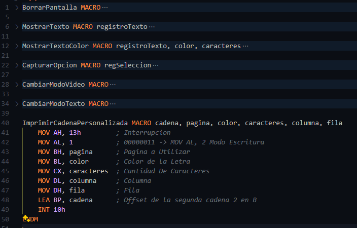
    

- **DATA**

    Dentro del apartado ".DATA" se definieron todas las variables y se inicializaron, ya sean los mensajes para mostrar en pantalla, así como las variables donde se almacena una entrada del teclado. El símbolo "$" es para indicar el final de una cadena.

    

        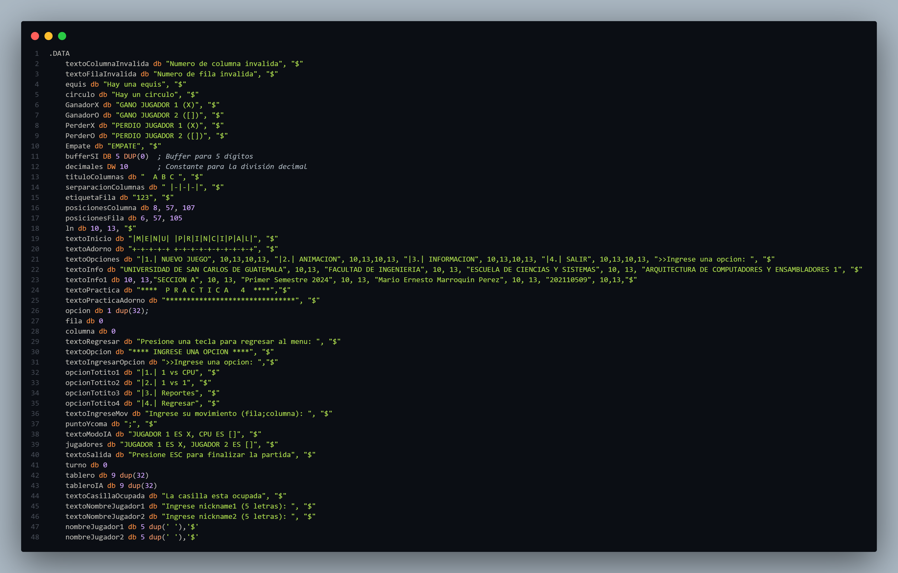
    

- **CODE**

    Dentro del apartado ".CODE" se realiza al ejecucion del programa, aquí es donde se define el flujo de la aplicacion.

    

        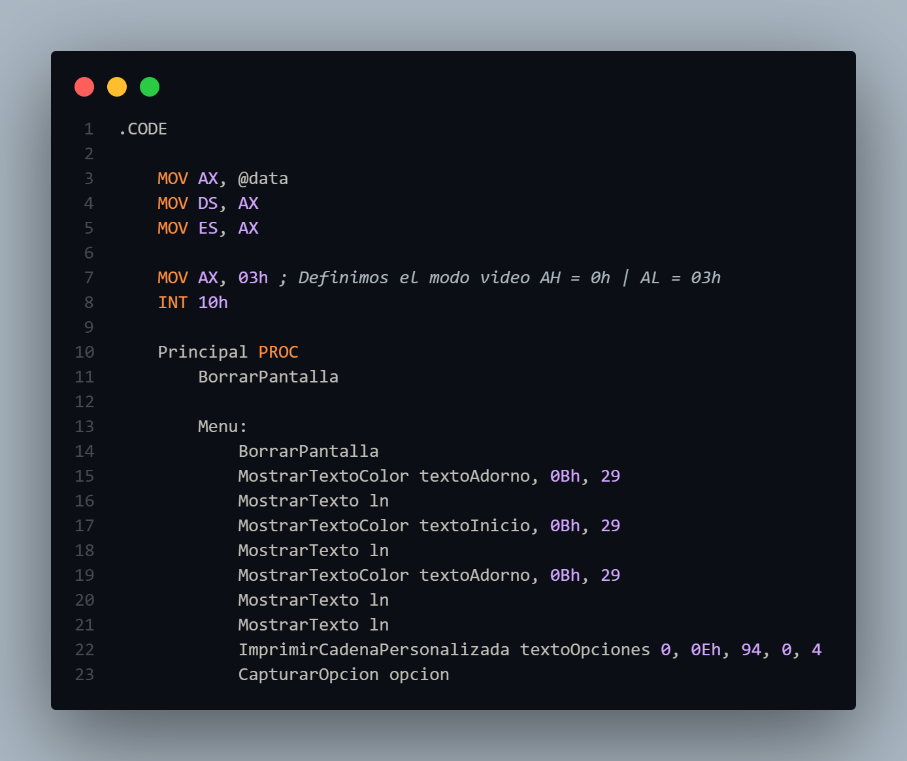
    

    Dentro de este apartado se obtiene la entrada del teclado, y se compara para conocer hacía que etiqueta se debe realizar el salto correspondiente.

    

        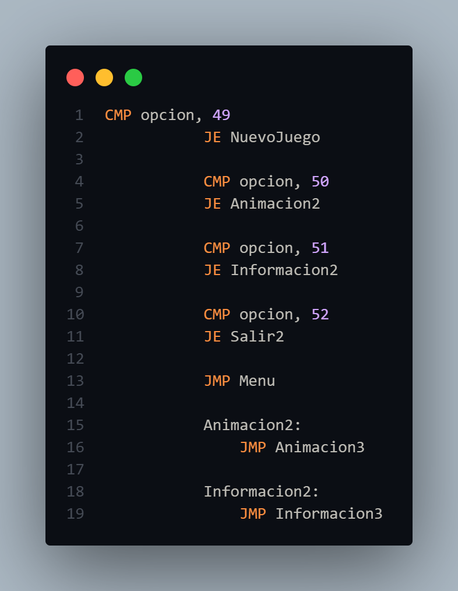
    

    Dentro de este apartado se utilizan distintas etiquetas, a las cuales se acceden a través de saltos, estas etiquetas cumplen con un rol específico, ya sea mostrar el tablero en pantalla, obtener la fila y columna, mostrar errores al ingreso de datos, generar el reporte HTML, etc etc.

    

        
    

- **Salida**

    Esta es la etiqueta responsable de finalizar con el flujo del programa, lo hace por medio de una interrupción (las cuales también son parte fundamental para mostrar o ingresar información al sistema).

    

        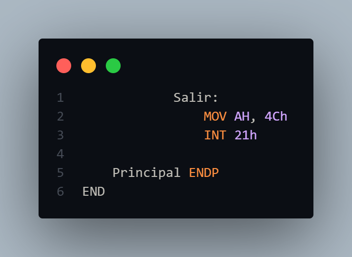
    

- **Consola**

    Dentro de la consola proporcionada por el IDE, visualizamos el emulador utilizado para la práctica, dentro de la consola también podremos observar (si existen) posibles erroes dentro de nuestro código, ayudando así a encontrarlos de una mejor manera y resolverlos.

    

        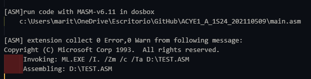
    

- **Configuracion DosBox**

    Para utilizar nuestro código ASM en DosBox debemos configurar el simulador, para ello debemos ingresar la ruta dentro de las configuraciones del simulador, haciendo esto, podremos observar la ruta de la carpeta de nuestro archivo al abrir el simulador.

    

        
    

    Direccion de nuestra carpeta en el simulador:

    

        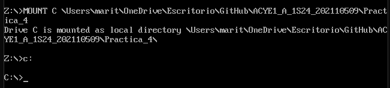
    

    

- **Bibliografías Utilizadas Durante el Desarrollo de la Práctica**

<a href="https://moisesrbb.tripod.com/unidad6.htm#u641" target="_blank">Interrupciones y manejo de archivos DOS</a>