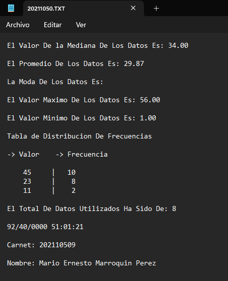
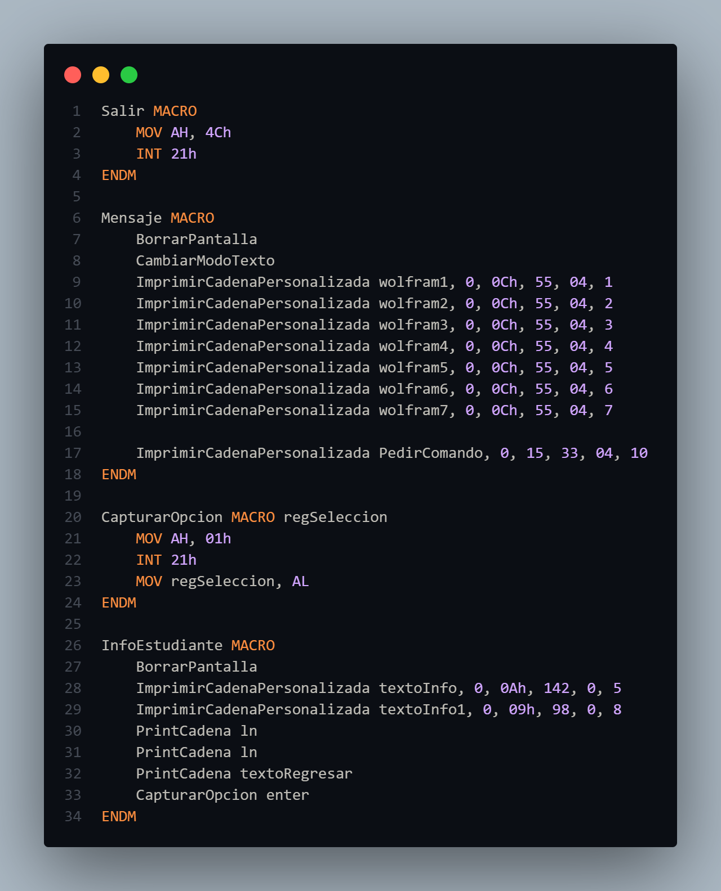
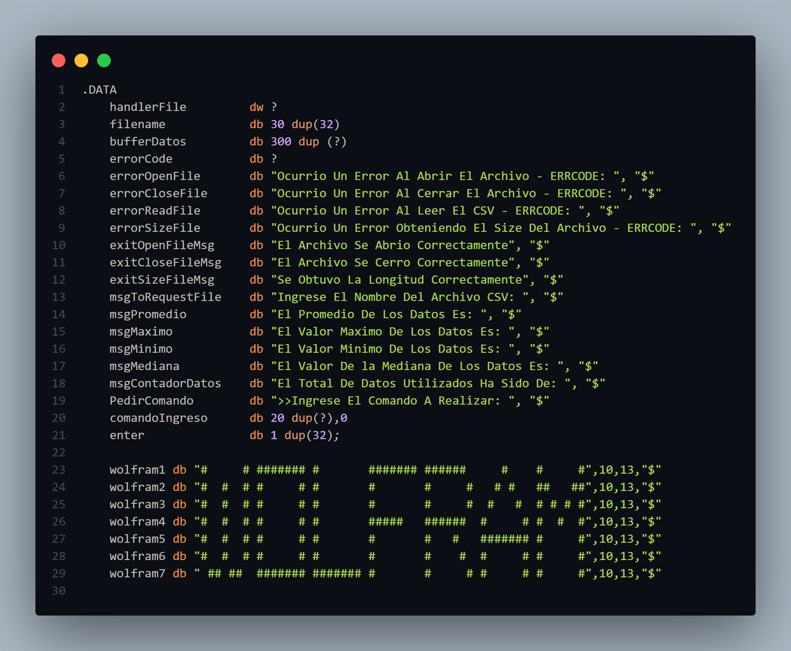
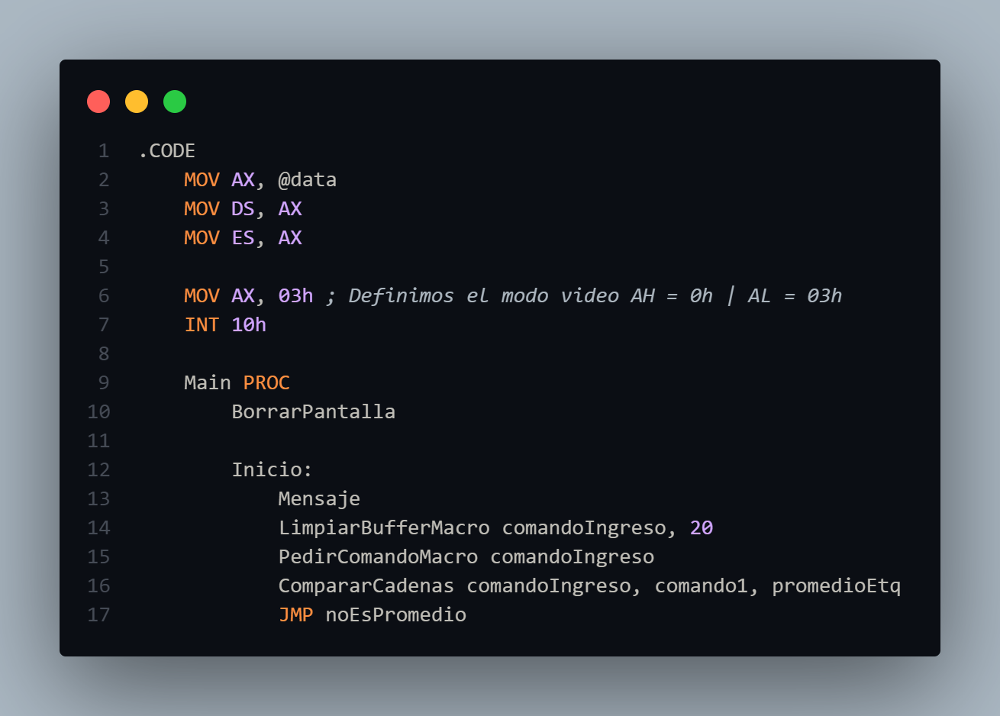
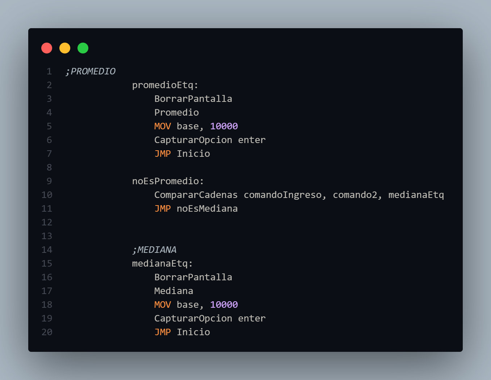
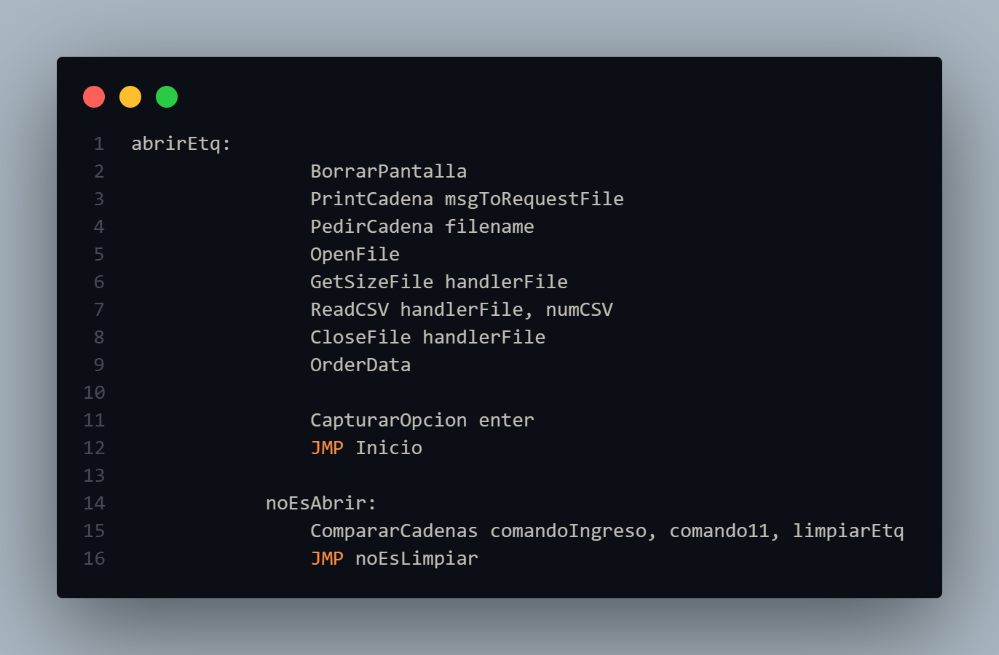
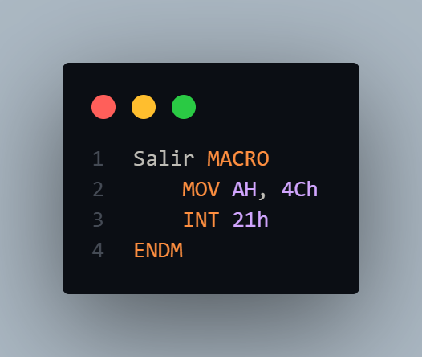

#  
**ACYE1_202110509**

## 
**PROYECTO 2**

## 📌 **Manual de Usuario**

- **Consola**

    Al iniciar el ejecutable el usuario podrá visualizar el menú principal de la aplicación así como información
    del desarrollador de la misma. 

    Dentro del menú se pueden acceder a distintas opciones, ingresando el número de la opción correspondiente.

    

        
    

- **Nuevo Juego**

    Una vez el usuario ingresa a la primera opción ("Nuevo Juego"), el juego iniciará y pedirá un nickname para la 
    partida, ESTE NICKNAME NO DEBE EXCEDER LOS 5 CARACTERES.

    

            
    

    Cuando se ingresa un nickname el sistema automáticamente iniciará la partida y se podrá visualizar el tablero de juego. 
    
    

            
    

    
    Así mismo se podrá visualizar distintas verificaciones indicando que en que etapa del juego se encuentran o como regresar al menú pricipal.

    

        
    

    Consecutivamente el usuario debe ingresar la fila y columna de la pieza que desea mover (fila y columna que se encuentren dentro del tablero), una vez ingresadas, dentro del tablero se visualizan unas "x" indicando los posibles movimientos de la pieza deseada a mover.

    **DENTRO DEL JUEGO ESTÁN DISPONIBLES TODOS LOS MOVIMIENTOS POSIBLES DE TODAS LAS PIEZAS DE UN TABLERO DE AJEDREZ**

    

        
    

    El usuario elige a que casilla marcada con una "x" moverá la pieza, esto ingresando la fila y columna, una vez ingresadas se podrá visualizar que la pieza se ha movido, el ciclo vuelve a repetirse, para regresar al menú principal el usuario debe ingresar una letra "m" ya sea en la fila o columna.

    

        
    

- **Puntajes**

    Dentro de esta sección el usuario podrá visualizar al ultimo jugador dentro de la partida.

    

        
    

- **Reportes**

    La aplicacion generará un reporte en formato HTML, en donde se detallan de mejor manera los jugadores y la información del desarrollador de la aplicación.

    

        
    

- **Salir**

    Se detiene el flujo de la aplicación y finaliza.

## 📌 **Manual Técnico**

- **Herramientas y Entorno de Desarrollo**

    La práctica fue realizada en Windows 11, utilizando software libre como el editor de código Visual Studio Code, DOSbox 0.74-3 y emu8086.

    Trabajando con MASM y distintas extensiones para VSCode.

    Las extensiones utilizadas fueron:

        1. MASM/TASM 
        2. MASM
        3. VSCode DOSBox

    Así mismo, se hizo utilización de tres archivos ejecutables para la compilación del main.asm en DOSBox, estos archivos se encuentran dentro de la carpeta ".exe necesitados". 

- **Macros**

    Las macros fueron de bastante utilidad en esta práctica, permitiendo realizar de cierta forma el papel de funciones de un lenguaje de alto nivel. Las macros fueron establecidas y declaradas al principio. Cada macro con un propósito específico, rellenar el tablero, limpiar consola, obtener entrada, etc etc.

    

        
    

- **DATA**

    Dentro del apartado ".DATA" se definieron todas las variables y se inicializaron, ya sean los mensajes para mostrar en pantalla, así como las variables donde se almacena una entrada del teclado. El símbolo "$" es para indicar el final de una cadena.

    

        
    

- **CODE**

    Dentro del apartado ".CODE" se realiza al ejecucion del programa, aquí es donde se define el flujo de la aplicacion.

    

        
    

    Dentro de este apartado se obtiene la entrada del teclado, y se compara para conocer hacía que etiqueta se debe realizar el salto correspondiente.

    

        
    

    Dentro de este apartado se utilizan distintas etiquetas, a las cuales se acceden a través de saltos, estas etiquetas cumplen con un rol específico, ya sea mostrar el tablero en pantalla, obtener la fila y columna, mostrar errores al ingreso de datos, generar el reporte HTML, etc etc.

    

        
    

- **Salida**

    Esta es la etiqueta responsable de finalizar con el flujo del programa, lo hace por medio de una interrupción (las cuales también son parte fundamental para mostrar o ingresar información al sistema).

    

        
    

- **Bibliografías Utilizadas Durante el Desarrollo de la Práctica**

<a href="https://moisesrbb.tripod.com/unidad6.htm#u641" target="_blank">Interrupciones y manejo de archivos DOS</a>
