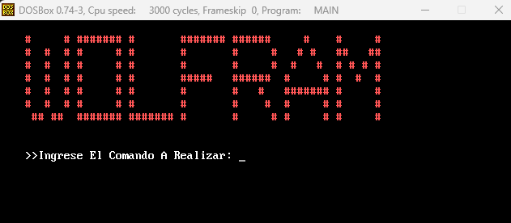
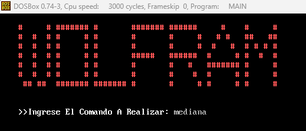
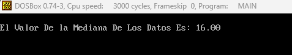
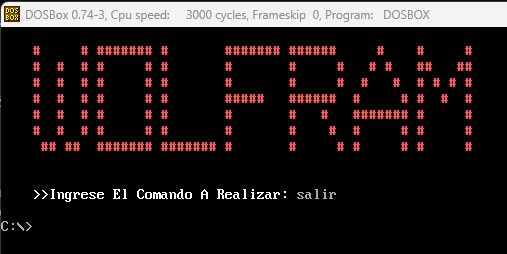

#  
**ACYE1_202110509**

## 
**PROYECTO 2**

## 📌 **Manual de Usuario**

- **Consola**

    Al iniciar el ejecutable el usuario podrá visualizar el menú principal de la aplicación así como el texto que indica que ingrese un comando a la consola. 

    

        
    

- **Comandos**

    Los comandos disponibles dentro de la aplicación son los siguientes:

        1. prom:  Mostrará en consola el resultado del promedio de los datos ingresados.
        2. mediana: Mostrará en consola el resultado de la mediana de los datos ingresados.
        3. moda: Mostrará en consola el resultado de la moda de los datos ingresados.
        4. max: Mostrará en consola el máximo número del conjunto de datosingresados.
        5. min: Mostrará en consola el mínimo número del conjunto de datosingresados.
        6. contador: Mostrar en consola el número de datos que se cargaron en el archivo de entrada.
        7. abrir: Entra al apartado para cargar el archivo csv y leer los datos.
        8. limpiar: Al ingresar este comando se limpia la consola y queda a la espera de otro comando.
        9. reporte: Al ingresar este comando se genera un reporte para visualizar los cálculos de mejor manera.
        9. info: Se muestra la información del desarrollador de la aplicación.
        10. salir: Termina el flujo del programa.

    

            
    

    Al presionar enter, se puede visualizar el valor de dicho comando.

    

            
    

    
- **Reportes**

    La aplicacion generará un reporte en formato TXT, en donde se detallan de mejor manera los datos matemáticos previamente realizados y la información del desarrollador de la aplicación.

    

        
    

- **Salir**

    Con este comando, se termina el flujo de la aplicación.
    

        
    

## 📌 **Manual Técnico**

- **Herramientas y Entorno de Desarrollo**

    La práctica fue realizada en Windows 11, utilizando software libre como el editor de código Visual Studio Code, DOSbox 0.74-3 y emu8086.

    Trabajando con MASM y distintas extensiones para VSCode.

    Las extensiones utilizadas fueron:

        1. MASM/TASM 
        2. MASM
        3. VSCode DOSBox

    Así mismo, se hizo utilización de tres archivos ejecutables para la compilación del main.asm en DOSBox, estos archivos se encuentran dentro de la carpeta ".exe necesitados". 

- **Macros**

    Las macros fueron de bastante utilidad en esta práctica, permitiendo realizar de cierta forma el papel de funciones de un lenguaje de alto nivel. Las macros fueron establecidas y declaradas al principio. Cada macro con un propósito específico, rellenar el tablero, limpiar consola, obtener entrada, etc etc.

    

        
    

- **DATA**

    Dentro del apartado ".DATA" se definieron todas las variables y se inicializaron, ya sean los mensajes para mostrar en pantalla, así como las variables donde se almacena una entrada del teclado. El símbolo "$" es para indicar el final de una cadena.

    

        
    

- **CODE**

    Dentro del apartado ".CODE" se realiza al ejecucion del programa, aquí es donde se define el flujo de la aplicacion.

    

        
    

    Dentro de este apartado se obtiene la entrada del teclado, y se compara para conocer hacía que etiqueta se debe realizar el salto correspondiente.

    

        
    

    Dentro de este apartado se utilizan distintas etiquetas, a las cuales se acceden a través de saltos, estas etiquetas cumplen con un rol específico, ya sea mostrar el tablero en pantalla, obtener la fila y columna, mostrar errores al ingreso de datos, generar el reporte HTML, etc etc.

    

        
    

- **Salida**

    Esta es la etiqueta responsable de finalizar con el flujo del programa, lo hace por medio de una interrupción (las cuales también son parte fundamental para mostrar o ingresar información al sistema).

    

        
    

- **Bibliografías Utilizadas Durante el Desarrollo de la Práctica**

<a href="https://moisesrbb.tripod.com/unidad6.htm#u641" target="_blank">Interrupciones y manejo de archivos DOS</a>
